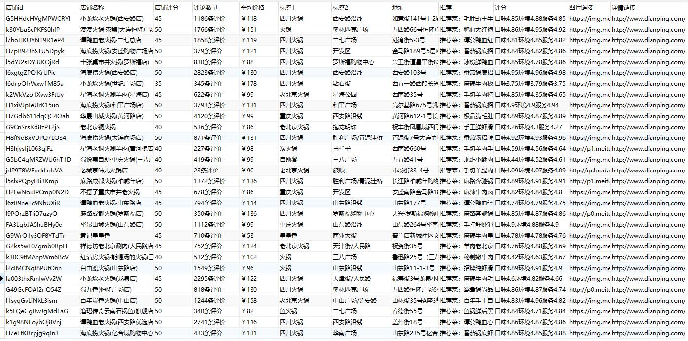

# Sniper

*仅限学习交流使用，禁止商用*

### 求求大家给个star吧！！这个对我真的很重要！！

大众点评爬虫框架，开发中。

商家搜索结果展示：

- 预期实现：
  - 商家搜索、各种信息获取
  - 评论爬取、详情信息爬取
  - 相关二进制文件下载
 
- 已实现：
  - 搜索页字体反爬处理，字体映射json生成
  - 评论页字体反爬处理，字体映射json生成
  - 存储器
  - 搜索页面以及存储
  - 字体文件映射缓存
  - 全局请求监控等待
  
 # 关于js加密
 
 目前代金券信息、详情页的部分评分信息是由js加密的，js加密位置已经找到了，但是由于那里用了什么“自执行函数”，还用了window全局变量，而且压缩过。
 本人没有学过js，只限于简单的阅读，经过长时间探索最终以失败告终，因此这一部分留给有能力的人完成。
 
 加密位置已经找到。
 
 main-shop.minxxxxxx.js --->var h  (变量 h后面接了一个方法，我也说不太清楚，大佬们看一下就知道了，具体位置为chrome自动整理的195行，pycharm自动整理的114行)
 
 调用到 rohr.min.js的一堆方法，但是入口就是那个h方法下的reload。
 
 main-shop.minxxxxxx.js文件可以通过download_file_for_test.py尝试获取，或自行下载。
 
 #### 十分希望有能力的大佬帮助解决一下，我也能学习学习，感谢。
   
   
- 已知问题：
  - 优惠券信息和详情页部分信息（这部分信息基本上可以在搜索页找到）使用单独的json接口，由js回调，js加密，加密位置已经找到，暂时没时间解出来。
  
- 相关功能笔记
  - [搜索页字体加密加密](http://www.sniper97.cn/index.php/note/carwler/3694/)
  - [评论页字体加密加密](http://www.sniper97.cn/index.php/note/carwler/3707/)

如果你想加快进度，点个star吧呜呜呜
