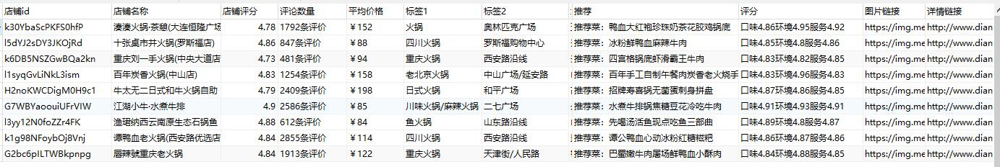
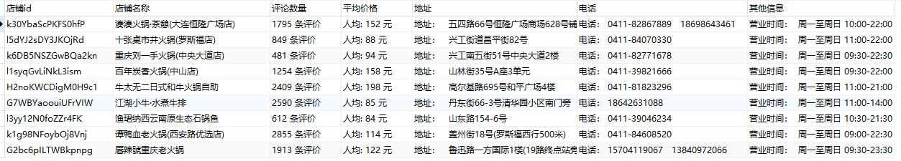
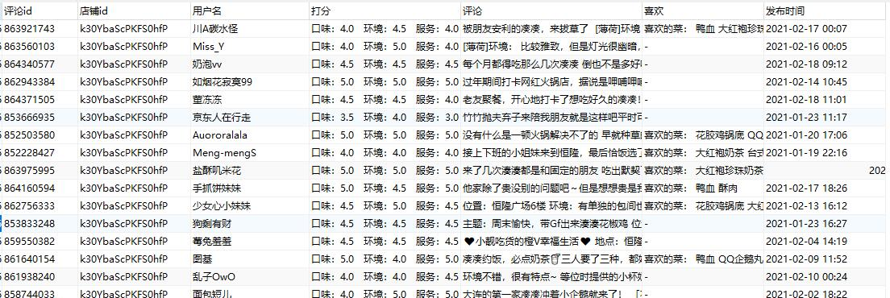

# Sniper

*仅限学习交流使用，禁止商用*

### 求求大家给个star吧！！这个对我真的很重要！！

大众点评爬虫框架，开发中。

本程序可以爬取大众点评搜索页、详情页以及评论页中的相关信息，并将结果写入文件或数据库中。

目前支持的写入类型如下：
- MongoDB数据库
- csv

如果您需要其他数据库支持，联系我们或者您添加后提PR。

## 环境配置
语言：python3

系统：Windows/Linux/MacOS

其他环境配置：

    pip install -r requestments.txt

## 使用方法：
### 配置配置文件
首先配置config.ini，参数意义在文件内已经有了详细说明，这里进行简单说明。

   - Cookie：Cookie信息（注意大写，之所以不一样是方便将浏览器信息直接复制进去而不做更改）。
   - user-agent：浏览器UA信息，不填则随机UA。
   - save_mode：保存方式，具体格式参照config.ini提示。
   - mongo_path：mongo数据库配置，具体格式参照config.ini提示。
   - requests_times：爬虫间隔时间，具体格式参照config.ini提示。
   - location_id：地区id，具体格式参照config.ini提示。
   - channel_id：频道id，具体格式参照config.ini提示。
   - search_url：搜索url，详见config.ini内提示。
   - need_detail：是否需要详情页。
   - need_comment：是否需要评论页。
   - review_pages: 获取的评论页页数。

### 运行程序
运行main.py（由于还在开发中，目前咱为main_debug.py）

如果遇到其他问题，详见[这里](https://github.com/Sniper970119/dianping_spider#可能遇到的问题)
 
## 字段结果展示
### 商家搜索结果展示：

### 商家详情页展示：

### 商家评论页展示：

## 其他
    
### 已知问题（希望大佬帮忙解决）：
  - 优惠券信息和详情页部分信息（这部分信息基本上可以在搜索页找到）使用单独的json接口，由js回调，js加密，加密位置已经找到，暂时没时间（其实是不会）解出来，详见[这里](https://github.com/Sniper970119/dianping_spider#%E5%85%B3%E4%BA%8Ejs%E5%8A%A0%E5%AF%86)
  
### 其他问题（可能造成体验不佳的地方）:
  - 由于部分情况可能不需要详情页爬取，因此对于搜索页信息可以和详情页做融合整理表暂不做处理（这也就造成了目前数据库不符合三范式），不过无所谓了，也没有修改打算（除非后期不改不行）。
  
### 关于js加密
 
 目前代金券信息、详情页的部分评分信息是由js加密的，js加密位置已经找到了，但是由于那里用了什么“自执行函数”，还用了window全局变量，而且压缩过。
 本人没有学过js，只限于简单的阅读，经过长时间探索最终以失败告终，因此这一部分留给有能力的人完成。
 
 加密位置已经找到。
 
 main-shop.minxxxxxx.js --->var h  (变量 h后面接了一个方法，我也说不太清楚，大佬们看一下就知道了，具体位置为chrome自动整理的195行，pycharm自动整理的114行)
 
 调用到 rohr.min.js的一堆方法，但是入口就是那个h方法下的reload。
 
 main-shop.minxxxxxx.js文件可以通过download_file_for_test.py尝试获取，或自行下载。
 
 #### 十分希望有能力的大佬帮助解决一下，我也能学习学习，感谢。

## 可能遇到的问题
1.显示：

        2021-02-09 16:18:47,166 - 23532-MainThread - function\detail.py[line:42] - WARNING: 详情页请求被ban
        2021-02-09 16:18:47,166 - 23532-MainThread - function\search.py[line:161] - WARNING: 详情信息获取失败，失败id：xxx
        
原因：由于大众点评过于苛刻的，出现这个意味着您触发了大众点评的反爬措施，暂时不能访问详情页（但是并不意味着您不能访问搜索页以及评论页）

解决方法： 调整config.ini requests_times参数然后，just wait（等解封）。或者暂时只爬取详情页。（后期可能会添加补救方法）
  
## 相关功能笔记
  - [搜索页字体加密加密](http://www.sniper97.cn/index.php/note/carwler/3694/)
  - [评论页字体加密加密](http://www.sniper97.cn/index.php/note/carwler/3707/)

如果你想加快进度，点个star吧呜呜呜
