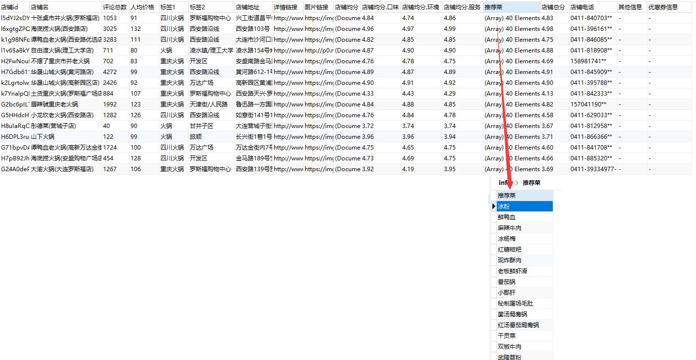
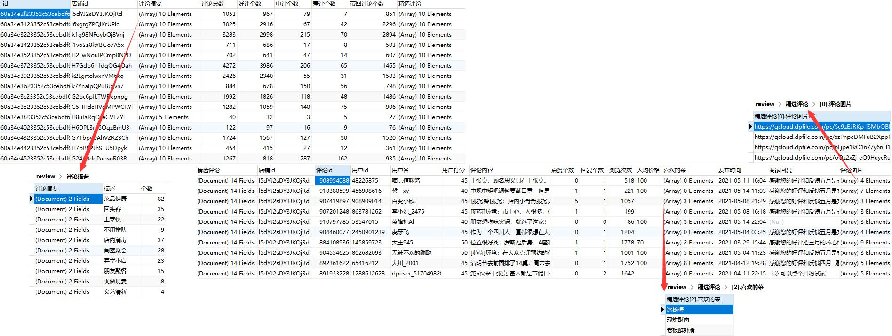

# Sniper

*仅限学习交流使用，禁止商用。未经授权禁止转载*

##### 本项目遵守GPL-3.0开源协议

##### 您可以使用本项目for yourself，如果您使用本项目获利（包括但不限于商用、程序代做以及其他私活），则不被允许；

##### 如果您未经允许使用本项目获利，本人保留因侵权连带的一切追责行为；同时造成的法律纠纷与本人无关。

### 求求大家给个star吧！！这个对我真的很重要！！

本程序可以爬取大众点评搜索页、详情页以及评论页中的相关信息，并将结果写入文件或数据库中。支持多cookie、ip代理以及多数据源爬取。

目前支持的写入类型如下：
- MongoDB数据库（支持）
- csv（新版可能会报错，还没适配 2021.05.10）

如果您需要其他数据库支持，联系我们或者您添加后提PR。

但是我强烈推荐使用非关系型数据库，比如我们支持的mongo数据库。新版本很多结构化数据拆起来太麻烦了，
这也就是为什么新版本到现在为止还没有适配csv存储的原因。

***

**由于大众点评反爬非常非常非常非常非常严格，因此使用了cookie池、ip代理等诸多防ban手段，同时框架赋予了使用者很高的操作自由度，**
**这就导致需要配置的参数较多(有30多个，不过大部分都可以使用默认项)，因此运行门槛相对不低。**

**虽然我已经尽量编写详细的使用文档，即便如此：**

**如果您是发现了bug或者有什么更好的提议，欢迎给我发邮件提issues、或PR，但是跟程序运行有关的所有问题请自行解决或查看[这里](https://github.com/Sniper970119/dianping_spider#%E8%BF%90%E8%A1%8C%E7%A8%8B%E5%BA%8F )。**

**不接受小白提问，自行研究。文档比较完善，阅读完完整文档后如还有有疑问，提问时请展示你思考验证的过程。**

***

## 开发计划

### 已支持

- 搜索信息（搜索结果，粗）

- 详情信息（比前一个多 地址、电话、营业时间）

- 评论信息

- cookie池

- ip代理

- 通过匿名接口，强势优化ip代理的作用

- 秘钥模式代理隧道支持

### 计划支持(最近几个月很忙，可能没办法更新，周末如果有空可能会更新)

- cookie动态更新（有可能缓解被ban的情况）

- 优惠券信息

## 环境配置
语言：python3

系统：Windows/Linux/MacOS

其他环境配置：

需要：lxml、requests、tqdm、faker、beautifulsoup4、fontTools、pymongo（optional）

或者一键配置：

    pip install -r requirements.txt

## 使用方法：

### 配置配置文件
首先配置config.ini，参数意义在文件内已经有了详细说明，这里进行简单说明。

**有的时候我可能会不小心将我的私人信息（比如远程数据库地址，代理隧道地址等）误上传到github上，希望大家能够自觉修改这部分参数。
我已经发现有人使用了我的私人远程数据库，甚至有人使用了我几十万条代理ip。**

|参数|说明|
|:-----  |-----|
|config：      |  |
|use_cookie_pool      |是否使用cookie池 |
|Cookie      |Cookie信息（注意大写，之所以不一样是方便将浏览器信息直接复制进去而不做更改）。|
|uuid      |uuid信息，[详见](./docs/json.md)|
|tcv      |tcv信息，[详见](./docs/json.md)|
|user-agent      |浏览器UA信息，不填则随机UA。|
|save_mode      |保存方式，具体格式参照config.ini提示。（目前只能为mongo） |
|mongo_path      |mongo数据库配置，具体格式参照config.ini提示|
|requests_times      |爬虫间隔时间，具体格式参照config.ini提示。  |
|detail：      |  |
|keyword      | 搜索关键字 |
|location_id      |地区id，具体格式参照config.ini提示。 [详见](./docs/location.md )  |
|channel_id      |频道id，具体格式参照config.ini提示。  |
|search_url      |搜索url，详见config.ini内提示。  |
|need_first      |是否只需要首页首条  |
|need_pages      |需要搜索的页数（搜索页）  |
|proxy:      |  |
|use_proxy |是否使用代理 |
|repeat_nub |ip重复次数，详见config.ini |
|http_extract |http提取 |
|key_extract |秘钥提取 |
|http_link |http提取接口 |
|proxy_host |秘钥模式服务器ip |
|proxy_port |秘钥模式服务器端口 |
|key_id |秘钥id |
|key_key |秘钥key |

然后配置require.ini，该配置文件用于选择爬取策略。

|参数|说明|谨慎选择|
|:-----  |-----|-----|
|shop_phone：      |  | |
|need      |是否需要店铺电话 |否|
|need_detail   |是否需要店铺电话细节（不需要为 12345678** ，需要详情为 12345678910） |是|
|shop_review：      |  | |
|need      |是否需要店铺评论 |否|
|need_detail   |是否需要店铺更多评论 （不需要则只有10条精选） |是|
|need_pages   |如果需要更多评论，需要多少页（一页30条） |否|

值得一提的是，对于谨慎选择的配置，由于需要登录才能获取，
因此请求会携带cookie，频繁请求会造成封号（过段时间自动解开）。

### 运行程序

正常搜索（完整流程，搜索->详情[可选]->评论[可选]）：
- 运行main.py

定制化搜索（不需要搜索，只需要详情或评论）:
- 只需要详情,shop_id 自行修改 （只给命令行格式，编译器运行则自行配置或修改代码）

    `python main.py --normal 0 --detail 1 --review 0  --shop_id k30YbaScPKFS0hfP --need_more False` 

- 只需要评论 

    `python main.py --normal 0 --detail 0 --review 1 --shop_id k30YbaScPKFS0hfP --need_more False`

- 需要详情和评论

    `python main.py --normal 0  --detail 1 --review 1  --shop_id k30YbaScPKFS0hfP --need_more False`
    
如果遇到其他问题，详见[这里](./docs/problems.md)
和[issues](https://github.com/Sniper970119/dianping_spider/issues?q=is%3Aissue+is%3Aclosed)

 
## 字段结果展示

由于大众点评反扒措施相对严重以及不同频道字段格式复杂，因此很多数据在爬取阶段不做处理。原样保存，后续自行清洗。
（新版本由于引入接口数据，有些数据为了对齐接口存储格式不得不进行处理）

同时由于数据结构化明显，不是很方便进行csv存储，以后的支持主流一定是mongo。

### 商家搜索结果展示：

### 商家评论页展示：

更多数据规约查看[这里](./docs/data.md)

## 一些碎碎念

关于cookie以及cookie池的一些碎碎念：[这里](./docs/cookie_pool.md)

关于存储的一些碎碎念：[这里](./docs/save.md)

关于使用加密接口的一些碎碎念：[这里](./docs/json.md)

关于ip代理的一些碎碎念：[这里](./docs/proxy.md)

一些可能遇到的小问题：[这里](./docs/problems.md)

  
## 相关功能笔记
  - [搜索页字体加密加密](http://www.sniper97.cn/index.php/note/carwler/3694/)
  - [评论页字体加密加密](http://www.sniper97.cn/index.php/note/carwler/3707/)

如果你想加快进度，点个star吧呜呜呜
