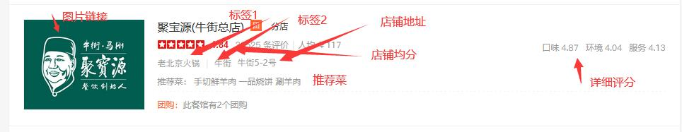

# Sniper

## 数据规约：

由于数据对齐的原因，有一些字段名字可能会轻微变化。

### search：

    {
                '店铺id': -,
                '店铺名': -,
                '评论总数': -,
                '人均价格': -,
                '标签1': -,
                '标签2': -,
                '店铺地址': -,
                '详情链接': -,
                '图片链接': -,
                '店铺均分': -,
                '推荐菜': *,
                '店铺总分': -,
                '店铺电话': -,
                '其他信息': #,
                '优惠券信息': *,
    }

###  review

    {
           '店铺id': -,
           '评论摘要': -,
           '评论总数': -,
           '好评个数': -,
           '中评个数': -,
           '差评个数': -,
           '带图评论个数': -,
           '精选评论': [
                          {
                            '店铺id': -,
                            '评论id': -,
                            '用户id': -,
                            '用户名': -,
                            '用户打分': [接口为单评分，网页为多评分],
                            '评论内容': -,
                            '点赞个数': *,
                            '回复个数': *,
                            '浏览次数': *,
                            '人均价格': -,
                            '喜欢的菜': -,
                            '发布时间': -,
                            '商家回复': -,
                            '评论图片': -,
                          }
                    ],
    }
    
    
    
由于采用了多种爬取方式，有些数据对于其它爬取方式并不可见，因此采用最大集的数据规约。

带*的为接口特有，带#的为网页特有，-则为都有。

