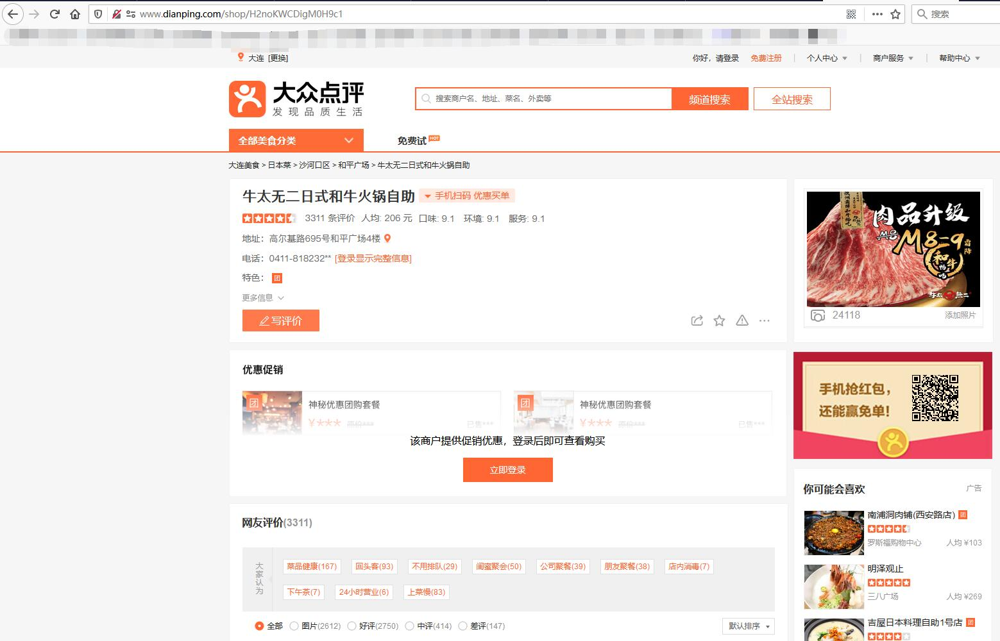
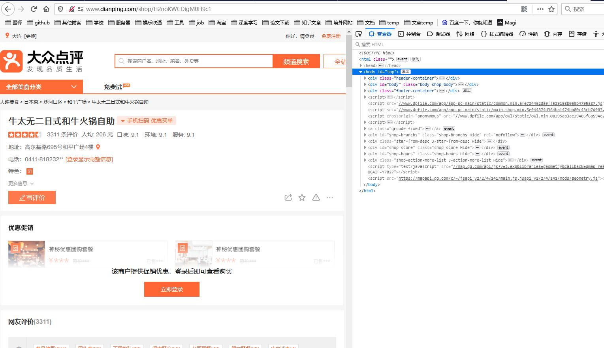
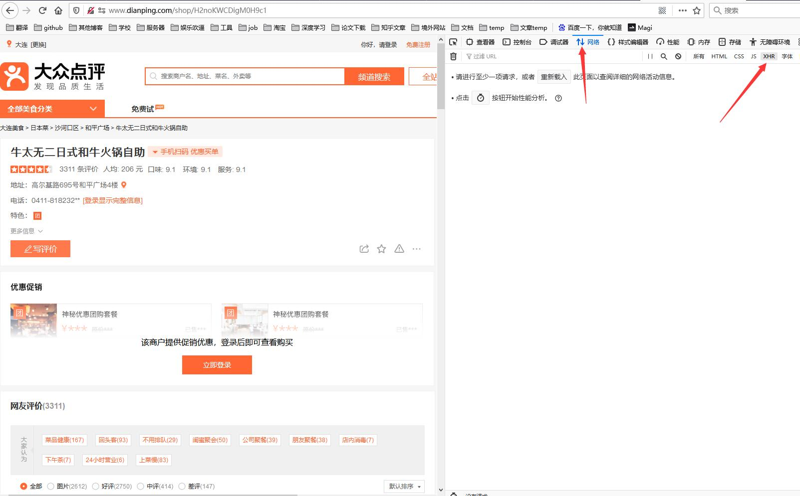
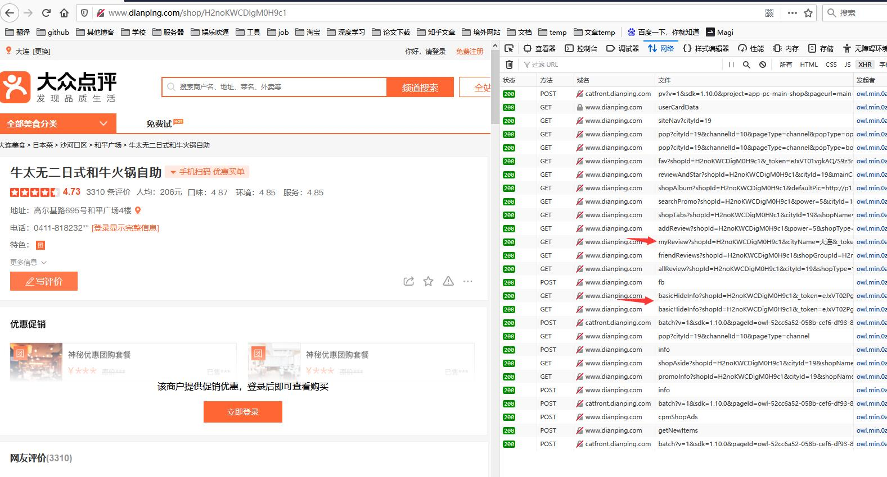
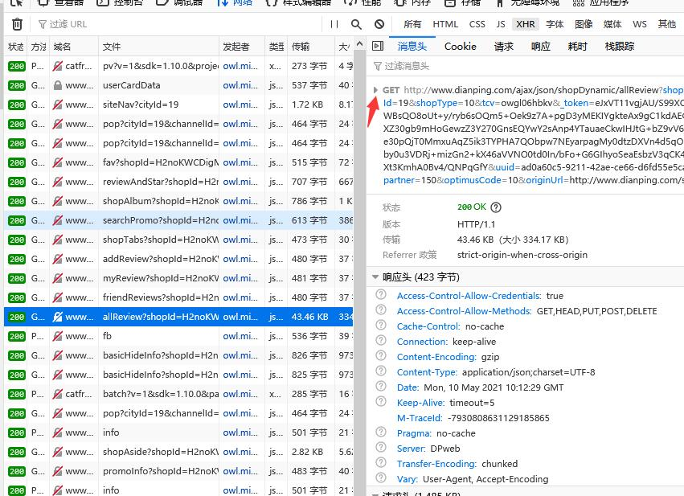
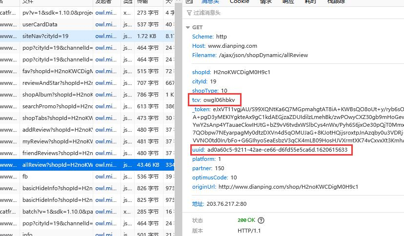

# Sniper

使用加密接口的相关配置.

## 写在前面

本项目使用了加密接口+网页解析融合的方式，但是由于使用接口（未登录状态）部分字段会隐藏（比如商家电话），
同时为了简略一些配置项，因此新增了一些参数来由程序自行决定使用接口还是网页。

**如果数据允许，十分建议使用接口，因为ip代理+接口带来的增益是无法想象的，也是目前第一版有望做到“无人值守”
的爬取版本。**

### 数据区别在哪？

那么使用接口和网页数据有什么区别呢？

主要有三点：

1.电话号不全。未登录（接口）状态电话号的末尾两位会隐藏。地址不会。

2.网页情况下，详情页的评分不准（因此也就没存），需要依靠搜索页的评分，而接口是准的（所以你在[主页](https://github.com/Sniper970119/dianping_spider#%E5%95%86%E5%AE%B6%E8%AF%A6%E6%83%85%E9%A1%B5%E5%B1%95%E7%A4%BA )能够发现详情我贴了两张图）。

3.评论接口只能获取10条，但是都是精选评论，浏览量千起。

因此：对于能接受上面接口缺点的用户，接口的意义十分重大。

接受不了的可以不往下看了，uuid和tcv都可以使用默认。

### 我怎样获得uuid和tcv？

首先访问大众点评任意商铺（最好为所需城市的，不是也无所谓）。

我们以我所在的城市为例（截图为firefox浏览器，其他浏览器都差不多）：

首先进入店铺详情页：

按F12 进入开发者模式

点击网络（chrome为Network），然后点击XHR

刷新网页（F5），然后就会发现右侧多了好多请求。
点击allReview（箭头打错位置了）或者basicHiddenInfo

我们以allReview为例，点击后点击小箭头

然后就可以发现uuid和tcv两个参数，复制到配置文件中即可。

另外一提，cookie在这个下面一点就可以看到，这个参数需要登录后获取。

### 为什么这两个参数不生成而要手动添加？

两个原因：

1. 这两个参数并不容易过期，并不像token的时效只有几秒，并且里面有时间戳信息，因此并不是必须生成。

2. 懒