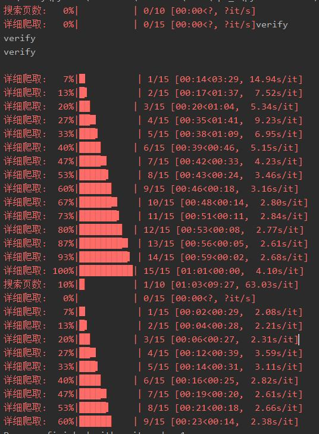

# Sniper

##  可能遇到的问题

写在最前面：本项目免费开源（获利除外），只是为了这点star将来简历也有的吹。

因此对于新手遇到的很多“不可解决”的问题本人并没有很多时间帮您解决。您可以尝试自己解决或者查看已有问题文档。

不要问我 “如果我想xxxx我是不是应该xxxx”， “xxxx应该怎么办？”，不接受小白和伸手党的提问，提问的时候展示你思考和验证的过程。

一些配置相关问题可以查看[我的碎碎念](https://github.com/Sniper970119/dianping_spider#一些碎碎念 )

### 0. SSLError：HTTPSConnectionPool

原因：多半是因为网络问题（比如电脑在使用全局代理），特别是在后面有完整的css链接的情况下。

解决方法：解决网络问题（不排除某些极端情况为点评更新解析规则导致的代码bug，至少现在不是\[2021.04.19]）

### 1.处理验证码，按任意键回车后继续 https://verify.meituan.com/v2/web/general_page?action=spiderindefence&xxxxx

原因：原因是触发大众点评的人机验证，需要处理验证码以通过人机验证拖延被封禁时间

解决方法：点击后面的链接，手动解决验证码。（仅会在非代理模式中出现，代理模式验证码会被直接抛掉[冷启动除外。代理模式并不是完全抛弃cookie，搜索依然要使用cookie，包括处理代理冷启动，所以还是会出现验证码的]）

### 2. WARNING: 详情页请求被ban：

        2021-02-09 16:18:47,166 - 23532-MainThread - function\detail.py[line:42] - WARNING: 详情页请求被ban
        2021-02-09 16:18:47,166 - 23532-MainThread - function\search.py[line:161] - WARNING: 详情信息获取失败，失败id：xxx
        
原因：由于大众点评过于苛刻的，出现这个意味着您触发了大众点评的反爬措施，暂时不能访问详情页（但是并不意味着您不能访问搜索页以及评论页）

解决方法： 调整config.ini requests_times参数然后，just wait（等解封）。或者暂时只爬取详情页。（后期可能会添加补救方法）

### 3. ERROR：代用代理吧小伙汁：

    2021-05-11 20:04:16,808 - 14220-MainThread -\function\detail.py[line:47] - ERROR: 使用代理吧小伙汁

原因：你和我一样，被大众点评重点关注了（也是我猜的，我的ip和cookie失效的好快，救命）。使用代理吧。

解决方法：使用代理，或者等待。

### 4. WARNING:cookie失效或者被限制访问

原因：cookie失效（或者压根不对）

解决方法：替换cookie（另外，有些情况是因为大众点评冷启动的验证码（也就是你这个cookie没有访问过该页的前置页，直接访问当前页，类似于没有爸爸直接访问儿子，这种情况点评会触发验证码，手动进入这个url解决验证码，后续就不会产生这个问题））

### 5. WARNING: 评论页请求被ban

原因： 评论页无法访问，cookie被封了（经验来说，不是ip）

解决方法：换号（换号，不是换cookie）或者 等待

### 6.WARNING: 替换tsv和uuid，或者代理质量较低

原因： tsv和uuid错误，更新这两个参数（实践表明，uuid比tsv更重要，所以一定要保证uuid的正确性）。
    或者是代理质量太低。

解决方法：替换这两个参数。详见[这里](./docs/json.md)。如果替换后依然提示，尝试再好好复制一遍（不知道为啥，我自己经常复制两次才好用）。
    或者换一家代理。

### 7.WARNING: json响应码异常，尝试更改提pr，或者提issue

原因： 加密接口的响应码，一般来说不会发生异常，如果触发这个异常则意味着大众点评的更新。

解决方法：联系我或者尝试自行解决。

### 8.WARNING: 评论页字体变更，尝试修改代码或者联系作者

原因： 加密字体文件的特征标记异常，一般来说不会发生异常，如果触发这个异常则意味着大众点评的更新。

解决方法：联系我或者尝试自行解决。

## 写在最后：

如果您看到这里依然没有解决您的问题，并且您认为并不是您配置文件或其他相关配置出错，欢迎给我发邮件（zhaoyu@sniper97.cn）或提issues，这两个回复速度一样，看到都能看到，看不到都看不到。

如果您发起提问（包括上面任何一种），十分建议您在正文添加一个大写字母A以作为您阅读过本页的标记，否则可能不会回复。

尽管这样，我还是希望大家能够在没办法确定是不是bug时给我发邮件询问，毕竟您的关注也是我更新的动力。

**PS:如果您不能运行,那一定不是bug**。

